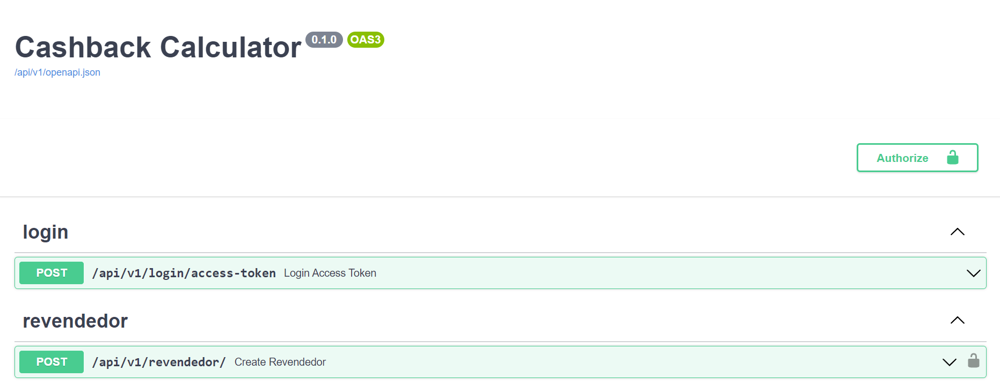
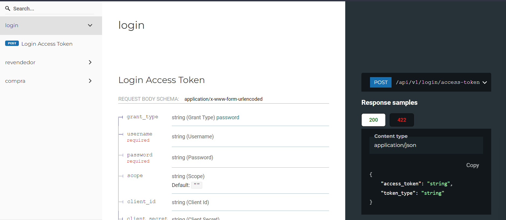

# desafio-boticario-backend-python

# Tecnologias

- python
- fastapi - web framework
- SQLAlchemy - SQL ORM
- alembic - database migration tool for SQLAlchemy
- pytest - test framework
- python-json-logger - logging json formatter
- sentry-sdk - SDK for [Sentry](https://sentry.io/)
- PostgreSQL - object-relational database

# Documentação

- [Swagger](http://127.0.0.1:8000/docs)
- [Redoc](http://127.0.0.1:8000/redoc)

# Como testar

    make test

Obs.: o banco irá subir automaticamente usando docker.

# Como formatar

    make format

Irá rodar `isort` e `black` para formatar os arquivos.

# Como rodar

## Local

Copie o arquivo `.template.env` para `.env` e preencha as variáveis de ambiente de acordo.

    make run/dev

Obs.: o banco irá subir automaticamente usando docker.

Para criar as tabelas rode:
   
    make db/upgrade

## Docker
